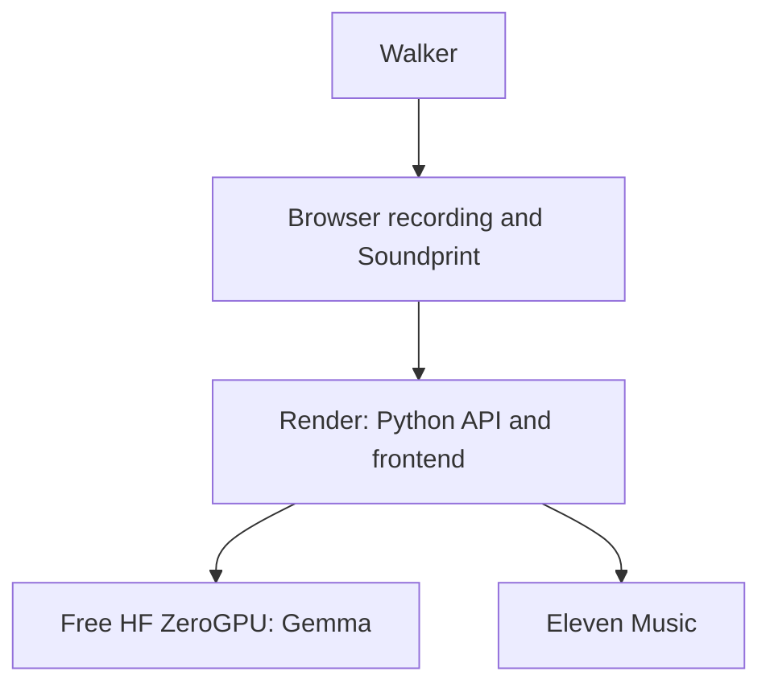
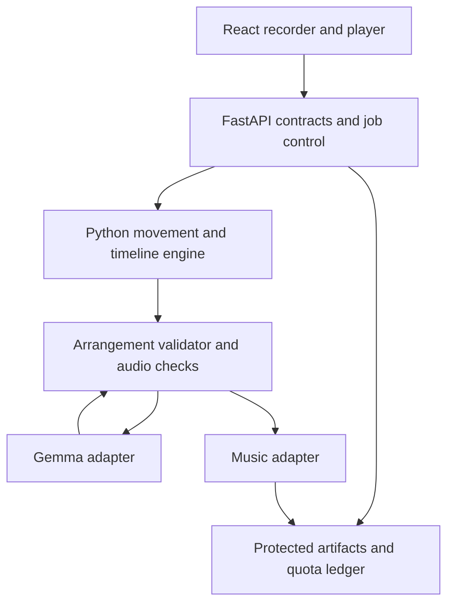
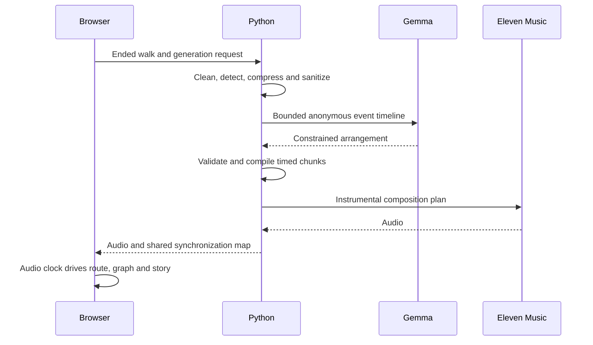

# HANDOFF.md — Footwork Implementation Contract

## Summary

- **Project:** Footwork
- **Thesis:** Your recorded walk becomes a short instrumental composition and synchronized visual Soundprint.
- **Hook:** A sharp turn changes the melody's direction. A pause becomes an audible musical break.
- **Deadline:** October 11, 2026, 11:59 PM PDT. Coding only October 9–10, with a maximum of 20 active hours.
- **Feature freeze:** Build hour 15, at 75% of the budget.
- **Stack:** React/TypeScript/Vite → Python/FastAPI on Render → Gemma on free Hugging Face ZeroGPU → Eleven Music.
- **Development toolchain (Phase 0):** CodeRabbit for code review, Entire for agent-session sharing, DevRelay for DEV write-ups, GitHub Actions for automated checks, Excalidraw for architecture diagrams. These are not part of the running application.
- **Plan:** Six phases, 30 original separately committed steps plus the Phase 1 UI/UX extension, one branch per phase. P1.8 through P1.13 and Daylight are on `build/experience`. The 290-minute budget decision is still open.
- **Largest risk:** Free Gemma availability and whether generated Studio audio makes the intended movement mappings perceptible.

---

## 1. Document Control

| Field | Locked value |
|---|---|
| Planning status | **LOCKED** |
| Planning date | October 8, 2026 |
| Toolchain amendment | October 8, 2026. User added CodeRabbit, Entire, DevRelay, GitHub Actions, and Excalidraw to Phase 0. Product scope and architecture boundaries are unchanged. |
| Source packet | Updated "PROMPT 0 → PROMPT 1 IDEA PACKET" in `Docs/handoff-0.md` |
| Hackathon | Hacktoberfest Open-Source AI Challenge: Week 1 |
| Deadline | October 11, 2026, 11:59 PM PDT; October 12, 2026, 12:29 PM IST |
| Working dates | October 9 and October 10, 2026 only |
| Active-work ceiling | **20 hours**, including commands, reviews, testing, documentation and submission preparation |
| Feature freeze | Build hour **15**, or **75%** |
| Execution authority | **A1:** agent edits files; user runs commands and controls branches, commits, pushes, merges and deployments |
| Repository | Existing skeleton; application implementation not started |
| Local path | `/home/kernel-kain/Documents/Github/footwork` |
| Remote | `git@github.com:kernelKain/footwork.git` |
| Inspected branch | `main`, tracking `origin/main` |
| Inspected baseline | `22df0e7 Initial commit` |
| Existing material | MIT license, minimal README, untracked `Docs/` planning material |
| Live URL | **NOT YET DEPLOYED** |
| Harness | Agent; planning reconnaissance was read-only |

Preserve existing `Docs/` material. Execution notes stay in `Docs/HANDOFF_2.md`.

> **This document contains the implementation contract. Execution may refine low-level details but may not change product scope, architecture boundaries, or acceptance criteria without following the change policy.**

No implementation, installation, branching, commits or deployment occurred during this planning stage.

---

## 2. Source of Truth

Authority order:

1. Official hackathon rules.
2. This locked handoff.
3. Current repository evidence.
4. Approved change decisions.
5. Execution notes.

Repository evidence determines what has actually been completed. Notes cannot turn an unverified feature into a completed feature.

Use these labels throughout execution:

- **VERIFIED FACT:** supported by inspected repository state or official documentation.
- **LOCKED DECISION:** the chosen implementation contract.
- **ASSUMPTION:** plausible but not demonstrated.
- **VERIFY IN P0:** an account, environment or provider check required before dependent work.

### User Corrections Incorporated

- Live browser location and movement recording is the input.
- There is **no file-upload requirement or upload interface**.
- Render credit is **$50**.
- ElevenLabs subscription is **Creator**.
- Gemma deployment must involve **no new spending**.
- Each phase has a separate branch.
- Each step has a separate commit.
- Commit messages describe the completed work in one line and contain no phase name or number.
- The execution authority is A1.

### Official Sources Consulted (checked October 8, 2026)

| Source | Fact learned and planning consequence |
|---|---|
| [Challenge page](https://dev.to/challenges/hacktoberfest-week1-2026-10-05) | Open-source AI must be central; writing quality carries substantial importance. Reserve time for the explanation and demonstrate Gemma's actual role. |
| [Challenge contest rules](https://dev.to/page/hacktoberfest-week1-2026-10-05-contest-rules) | Deadline and submission window verified. Submission needs the required explanation, repository and demo evidence. |
| [General hackathon rules](https://dev.to/page/official-hackathon-rules) | User eligibility remains a user-side P0 check. |
| [HF Spaces overview](https://huggingface.co/docs/hub/spaces-overview) | Do not assume ordinary new CPU compute Spaces are available free. Use the documented eligible-account ZeroGPU path. |
| [HF ZeroGPU](https://huggingface.co/docs/hub/spaces-zerogpu) | Gradio hosting, supported runtimes and shared daily quotas constrain the Gemma service. Free owner quota is five GPU minutes daily; the proxy shares that owner allowance. |
| [Gemma checkpoint](https://huggingface.co/google/gemma-4-E2B-it) | Choose `google/gemma-4-E2B-it`; Apache 2.0 license. Use bounded text generation without thinking output. |
| [Gemma documentation](https://ai.google.dev/gemma/docs/core) | Memory depends on precision and runtime; actual loading must be proved rather than inferred from the model name. |
| [Tinker catalog](https://tinker-docs.thinkingmachines.ai/tinker/models/models_and_pricing/) | Gemma was absent from the inspected published catalog. Tinker is not the planned deployment path. |
| [Eleven composition plans](https://elevenlabs.io/docs/eleven-api/guides/how-to/music/composition-plans) | Music v2/v2.5 uses timed `chunks`; use that contract rather than the older sections schema. |
| [Eleven compose API](https://elevenlabs.io/docs/api-reference/music/compose) | Explicit model selection is necessary. Timed chunks do not guarantee the requested audible melodic behavior. |
| [Eleven Music product](https://elevenlabs.io/docs/eleven-creative/products/music) | Paid subscription access is documented; actual key, model access and balance still require P0 proof. |
| [Music terms](https://elevenlabs.io/music-terms) and [model-specific terms](https://elevenlabs.io/eleven-music-model-specific-terms) | Verify the intended bundled application and demo use under the actual plan. Do not assume generated music inherits the repository's MIT license. |
| [Render FastAPI](https://render.com/docs/deploy-fastapi), [compute plans](https://render.com/docs/compute-plans), [pricing](https://render.com/pricing) | One Render Python service can serve the frontend and API. Select a small paid instance within existing credit after checking account coverage. |
| [Render free services](https://render.com/docs/free) | Free web services can sleep; they are not the reliable-demo default. |
| [Geolocation API](https://developer.mozilla.org/en-US/docs/Web/API/Geolocation_API) | HTTPS and permission are required. Callback frequency and positioning quality are not guaranteed. |
| [Wake Lock API](https://developer.mozilla.org/en-US/docs/Web/API/Screen_Wake_Lock_API) | Wake locks can release when the document becomes inactive. Screen-off recording is not promised. |
| Official npm registry and [Vite guide](https://vite.dev/guide/) | React 19.3.0 and Vite 8 were inspected; Vite's supported Node requirements govern toolchain setup. |
| PyPI: [FastAPI](https://pypi.org/project/fastapi/), [Pydantic](https://pypi.org/project/pydantic/), [Uvicorn](https://pypi.org/project/uvicorn/) | Inspected versions: 0.143.0, 2.13.5 and 0.54.0 respectively. |
| PyPI: [Gradio](https://pypi.org/project/gradio/), [Transformers](https://pypi.org/project/transformers/) | Inspected versions: 6.29.1 and 5.19.0. Verify their resolved dependency set on the chosen ZeroGPU runtime. |

---

## 3. Product Contract

**Name:** Footwork.

**Thesis:** A real walk writes a short instrumental soundtrack through its movement structure.

**What:** Record a walk in the browser, derive meaningful movement events, generate an arrangement and instrumental track, and play an abstract route and explanation in synchronization with the audio.

**Why:** Activity summaries preserve distance and duration but do not express the character of a journey.

**Hook:** The route cursor reaches a sharp turn as the melody changes direction. A recorded pause becomes a visible and audible break.

**Target user:** A casual walker or runner finishing a meaningful outing.

**Trigger:** The user opens Footwork before going outside, starts recording, then ends the walk.

**User job:** Turn this outing into something expressive and understandable.

**Input:** Permissioned browser position samples containing coordinates, accuracy and timestamp. One locked mood: **Warm Cinematic**.

**Core mechanism:**

1. Python validates and cleans movement.
2. It detects turns, pace changes, pauses and loops.
3. It compresses the journey chronologically into a 60-second timeline.
4. Gemma proposes a constrained musical arrangement.
5. Python validates that arrangement and compiles timed Eleven Music chunks.
6. A shared synchronization map drives playback, route position, graph markers and Movement Story.

**Visible output:**

- A 45–60-second instrumental **Studio Track**.
- An abstract route with synchronized cursor and markers.
- A **Route–Sound Graph** showing intended musical mappings.
- A short **Movement Story**.
- A plain label for what the person is hearing: their walk, an example, or a simpler version. Technical provenance stays in metadata and submission evidence, not in a public section.

**Sponsor roles** are real product responsibilities. They are documented in the README and submission evidence, not as sections of the application:

- Gemma: open-weight arrangement director.
- ElevenLabs: Studio Track production.
- Render: public frontend and Python runtime.

**Non-wrapper moat:** Deterministic event extraction, chronological timing, constrained plan validation, privacy transformation, audio checks and one shared audiovisual timeline.

**Current alternative:** A route screenshot or unrelated generated song. Neither demonstrates how movement caused specific musical events.

**Must-be-true claim:**

> Given a real browser-recorded movement trace with meaningful events, the system produces a 45–60-second instrumental Soundprint with at least three perceptible movement-to-music relationships under adequate position quality and available generation services.

"Pleasant" and "perceptible" require human listening evidence. Provider instructions alone do not establish either.

---

## 4. Success and Acceptance Criteria

All criteria below are **required** unless marked stretch.

| ID | Observable condition | Verification |
|---|---|---|
| AC-01 | On HTTPS mobile, user grants location permission, starts a walk, ends it and reaches a result without uploading a file. | Real outdoor browser recording and end-to-end evidence. |
| AC-02 | Deterministic Route Sketch changes melodic direction at the turn marker and creates an audible break at the pause marker, within 500 ms of the shared timeline. | Automated note/timing and pause-energy test; browser playback check. |
| AC-03 | A prepared genuine Studio Track demonstrates at least three mappings, including the turn and pause Hook. | Recorded listening review with timestamped evidence; fail if only visuals support the claim. |
| AC-04 | An actual named Gemma checkpoint processes an anonymized event timeline and returns a validated arrangement used downstream. | Sanitized request/result evidence, provider identity and arrangement hash. |
| AC-05 | An actual Eleven Music response produces the prepared Studio Track from the validated arrangement. | Sanitized provider receipt, request hash and audio provenance manifest. |
| AC-06 | With either provider unavailable, the current user's trace produces a clearly labeled Route Sketch; a separate cached example remains playable. | Injected failures and fixture replay tests. |
| AC-07 | Public Render HTTPS URL serves landing page, frontend, API health and demo playback. | External smoke check on mobile and desktop. |
| AC-08 | Cached playback becomes ready within five seconds on the tested network; live generation ends or falls back within 180 seconds. | Measured smoke-run timings, with device/network recorded. |
| AC-09 | Four event detectors pass positive and negative fixtures; no invalid trace is converted into invented movement events. | Python unit tests and real-trace inspection. |
| AC-10 | Playback and scrubbing keep route, graph and story within 500 ms of the audio clock at selected anchors. | Browser end-to-end assertions and manual audio check. |
| AC-11 | Permission denial, poor signal, gaps, timeout, quota and provider failure each show an explanation and usable next action. | State matrix checks. |
| AC-12 | Core recording and playback actions work by keyboard; normal text meets 4.5:1 contrast; reduced motion remains understandable. | Accessibility scan plus keyboard and reduced-motion review. |
| AC-13 | No horizontal overflow or obscured core action at 390 px mobile and 1280 px desktop. | Browser screenshots and interaction checks. |
| AC-14 | No secrets or raw locations enter repository, public fixture assets, logs or AI provider prompts. | Artifact/log inspection and secret scan. |
| AC-15 | Generation caps survive a service restart; duplicate requests do not dispatch another paid generation. | Ledger restart and idempotency tests. |
| AC-16 | Submission contains working links, required tags/template, repository, demo, technical explanation, AI-use disclosure and sponsor evidence. | Final submission checklist. |
| AC-17 | Decoded audio lasts 45–60 seconds within 0.5-second tolerance, contains valid finite samples and passes listening review for clipping and unintended silence. | Audio validation plus headphones review. |
| AC-18 | Same event/result contract drives live, synthetic fixture, cached example and Route Sketch modes. | Contract and fixture-parity tests. |
| AC-19 | Additional mood or prepared remix passes all existing criteria without extending the budget. | **Stretch; excluded from the execution queue.** |

Failure of AC-03, AC-04 or AC-05 prevents claiming the complete live Studio pipeline works. The fallback may still demonstrate the product, with the limitation stated.

---

## 5. Scope Lock

### Must Build

- Browser movement recording with explicit permission and recording status.
- Local draft recovery and visible interruption handling.
- One mood.
- Four event detectors.
- Chronological compression.
- Gemma arrangement and strict validation.
- Timed Eleven Music integration.
- Deterministic Route Sketch.
- Synchronized route, graph, player and story.
- Complete fixture experience before substantial backend implementation.
- Cached genuine example, clearly labeled.
- Basic privacy transformation, cost controls and error states.
- Public deployment, automated Hook test and submission artifacts.

### Should Build

Only before freeze and without delaying required work:

- Wake-lock support where available.
- A simple "keep this page visible" recording view.
- Clear generation-stage explanations.
- A privacy explanation beside the result.

### Could Build

Only after all required gates pass, within unused time:

- One prepared remix.
- A second mood.
- A more detailed story.

These are not scheduled work.

### Will Not Build

| Exclusion | Reason |
|---|---|
| GPX, audio or other uploads | User explicitly requires browser recording; additional parsing creates unnecessary scope. |
| Native apps or guaranteed background recording | Platform work exceeds the budget. |
| Music generated continuously during a walk | Cost, latency and reliability risk; does not support the post-walk Hook. |
| External maps, geocoding or elevation services | Unnecessary API dependency; abstract route is sufficient. |
| Elevation mapping | Browser elevation quality is uncertain; not required for the core demonstration. |
| Accounts, galleries, social feeds and public user directories | Privacy and authorization scope. |
| Unique public links for individual walks | Retention and sharing controls belong after the hackathon. |
| Audio downloads and remix marketplace | Rights and distribution scope. |
| Lyrics or artist imitation | Outside the instrumental contract and introduces avoidable rights concerns. |
| Model training or fine-tuning | No requirement and insufficient time. |
| Paid Gemma deployment | User constraint. |
| Redis, Celery, Kubernetes or a second backend language | No workload requirement. |
| Production-grade privacy guarantees | Cannot establish them within this build. |
| Product telemetry analytics and LangSmith | Extra dependency, data handling and integration scope. This does not exclude the local, privacy-safe movement summary planned for the Soundprint result. |

---

## 6. User Journey and Functional Requirements

| Journey | System and visible state | Error/fallback | Criteria |
|---|---|---|---|
| Open Footwork | Landing explains recording and displays "Start walk" and "Play example." | Backend outage still permits bundled example playback. | AC-06, 07 |
| Start walk | Explains location use, requests permission and waits for a usable fix. | Denial shows browser-setting guidance and example action. | AC-01, 11 |
| Walk | Shows duration, signal quality and unmistakable recording indicator. | Gaps and hidden-page interruptions are recorded and explained. | AC-01, 09, 11 |
| End walk | Stops geolocation watch, saves draft and evaluates quality. | Too little movement or poor quality produces an honest invalid-input state. | AC-01, 09 |
| Generate | Shows processing, arranging and composing stages. | Deadline, quota or provider failure switches to Route Sketch. | AC-04–06, 08 |
| Play Soundprint | Audio, route, markers and story share one clock. | Playback restriction asks for a user gesture; missing Studio audio offers Sketch. | AC-02, 03, 10 |
| Scrub | Route cursor and graph immediately follow the chosen audio time. | Invalid media seek is bounded to valid duration. | AC-10 |
| Clear | Removes local draft and requests deletion of server result. | Explains if remote deletion could not be confirmed. | AC-14 |

### Functional Requirements

- **FR-01:** Start/stop permissioned browser recording.
- **FR-02:** Persist the active draft locally and recover interrupted recording.
- **FR-03:** Explain permission, signal and visibility limitations.
- **FR-04:** Validate, clean and quality-score movement.
- **FR-05:** Detect turns, pace changes, pauses and loops.
- **FR-06:** Build one chronological synchronization map.
- **FR-07:** Obtain and validate a Gemma arrangement.
- **FR-08:** Generate and inspect Eleven Music audio.
- **FR-09:** Produce deterministic audio for the same user trace.
- **FR-10:** Play and scrub all result views together.
- **FR-11:** Show a factual Movement Story. Keep technical provenance in metadata and submission evidence, not as a public section.
- **FR-12:** Replay fixtures through the same result interface.
- **FR-13:** Enforce payload, concurrency, quota and idempotency limits.
- **FR-14:** Deploy and document a checkable demonstration.

### Required Visible States

The public names and copy are in `Docs/FRONTEND_EXPERIENCE.md`. This table is the acceptance vocabulary. It maps onto those names rather than adding a second public interface.

| State | Expected display | Public name |
|---|---|---|
| Initial | Product explanation, recording action and example. | Ready |
| Loading | Waiting for position or generation stage. | Checking location, or Processing |
| Empty | No recorded walk; no fabricated statistics. | Ready, before a walk starts |
| Success | Valid result with explicit mode. | Complete, with a plain label |
| Partial | Valid trace but insufficient event variety, or Sketch instead of Studio. | Complete, labeled as a simpler version |
| Recoverable error | Permission, network or playback problem with next action. | Permission denied, or Recoverable error |
| Dependency unavailable | Provider disabled/unavailable; Sketch and cached example offered. | Recoverable error, with the example kept separate |
| Invalid input | Inadequate or inconsistent movement; explain what was missing. | Recoverable error for a short or unclear walk |

No account creation is required.

---

## 7. UX and Visual Specification

**Visual thesis:** The route performs its own music.

**Signature moment:** A highlighted route corner and matching graph marker light up together as the musical turn occurs.

| Property | Lock |
|---|---|
| Primary viewport | 390 px mobile |
| Desktop floor | 1280 px |
| Theme | Dark ink background |
| Typography | System sans serif; restrained monospace for timestamps and technical details |
| Palette | Mint for route/progress, warm gold for musical events, textual warning/error labels |
| Density | One dominant visualization; supporting information beneath it |
| Spacing | Consistent 8 px spacing scale |
| Motion | Audio-clock route cursor; restrained transitions |
| Reduced motion | Static route plus active marker and text; no animated travel required |
| Controls | Intentionally styled, visible focus, labeled icons and usable touch targets |

### Screens (maximum two public destinations)

`Docs/FRONTEND_EXPERIENCE.md` is the public page contract from October 9, 2026. The table below matches it. `/` is the landing and practice recording journey, and `/about` redirects to `/#how-it-works`. `/studio` is the generation screen and the Soundprint. It has no sponsor section, provenance section, or generation preview control.

| Screen | Purpose/content | Actions | States and Hook relationship |
|---|---|---|---|
| `/` — Walk | Explain the product, record, and end a walk. How it works is `#how-it-works` on this page. | Start walking; Hear an example; End walk | Ready through recording, ending, and recoverable recording errors. |
| `/studio` — Soundprint | Hero, route, movement-to-music timeline, short story, and optional details. No sponsor or provenance sections. | Play, Pause, Replay, scrub, choose a moment, Start another walk | Processing, complete, and generation errors. Contains the Hook. |
| `/about` | Redirects to `/#how-it-works`. | None of its own | Not a third destination. |

### Reusable Regions

- Recording status, in words as well as color.
- Soundprint hero, with the honest example or generated label.
- Route canvas built with SVG, including start, end, and event markers.
- Shared player and scrubber.
- Movement-to-music timeline.
- Short walk story.
- Optional details in a disclosure. Provenance stays in the result data and is not a public region.
- Recovery notice with a next action.
- How it works, on `/`.

Developer fixture controls, a global Walk / Soundprint / How it works navigation bar, and public Sponsor or Provenance sections are not part of this region list. Technical provenance stays in fixtures, developer docs, and submission evidence.

### Quality Floor

- No lorem ipsum, invented users or unsupported metrics.
- Synthetic routes and prepared examples are visibly labeled.
- Status never depends only on color.
- Normal text contrast is at least 4.5:1.
- Every core action has a visible keyboard focus state.
- Mobile layouts use stacked regions; no tiny desktop graph squeezed onto a phone.
- Playback information remains available as text when motion is reduced.
- Location activity remains visible throughout recording.

---

## 8. System Architecture

### System Context



### Component / Container View



### Hook Sequence



### Component Contracts

| Component | Responsibility; input → output | State, dependencies and failure | Location |
|---|---|---|---|
| Recorder | Position callbacks → timestamped samples and interruption markers | IndexedDB draft; browser geolocation. Denial/gaps remain visible. | Browser |
| Result UI | Result contract + audio → synchronized presentation | UI state and audio clock. Falls back to bundled example if API fails. | Browser |
| API/job controller | Validated request → job state and authorized result | One active job; quota reservations; protected artifact paths. Rejects excess work before dispatch. | Render |
| Movement engine | Samples → cleaned trace, events, quality and timeline | Transient raw input only. Invalid data cannot create invented events. | Render |
| Arrangement validator | Gemma JSON → bounded musical plan | Shared schema. Invalid output receives at most one budgeted repair attempt. | Render and HF |
| Gemma service | Anonymous event timeline → arrangement JSON | Loaded model; shared HF queue/quota. Timeout produces explicit provider failure. | HF ZeroGPU |
| Music adapter | Validated plan → Studio audio | Provider request receipt. Ambiguous network failure is not automatically retried. | Render |
| Sketch engine | Same timeline → deterministic PCM audio | Local synthesis; no provider dependency. | Render |
| Artifact/ledger store | Job outputs and reservations → protected retrieval | Durable files; cleanup and conservative restart recovery. | Render disk |

**Live flow:** Record → validate → extract → sanitize → Gemma → validate → Eleven Music → audio checks → shared result.

**Fallback flow:** The same extracted timeline → deterministic Route Sketch → identical result contract.

**Fixture flow:** Versioned result manifest and prepared audio → identical player. No fake API completion response.

### Trust Boundaries

- Location permission and raw draft stay under browser control.
- Raw coordinates cross HTTPS only to the project API for processing.
- External AI providers receive event summaries, not coordinates or original timestamps.
- Public assets contain only approved sanitized fixtures.
- Job artifacts require a per-job capability.
- Provider keys never reach the frontend.

A static-only application would not provide the required Python processing and protected provider access. Additional queues, databases and microservices are unnecessary for one concurrent hackathon job.

The separate HF service exists specifically to satisfy free Gemma hosting.

---

## 9. Stack and Toolchain Lock

| Area | Choice / version rule | Why; rejected alternative |
|---|---|---|
| Backend language | Python **3.12.12** | Align with the inspected ZeroGPU-supported runtime. Reject Node backend: one backend language. |
| API | FastAPI **0.143.0**, Uvicorn **0.54.0** | Typed small API. Reject Django: unnecessary application framework. |
| Validation | Pydantic **2.13.5** | Strict arrangement, request and result contracts. Reject unvalidated model JSON. |
| Frontend | TypeScript 5.x, React **19.3.0** | Existing skill fit and flexible visual revisions. Reject framework migration. |
| Build | Vite **8.x**, supported Node 22.x ≥22.12 | Small SPA and fast development. Reject server-rendering framework: no requirement. |
| Styling | CSS variables and component CSS | Easy visual revision without another UI dependency. |
| Frontend state | React state/reducer; IndexedDB for draft | Small state surface. Reject Redux and cloud persistence. |
| Visualization | SVG route and graph | No tiles, map key or mapping API. |
| Playback | Browser audio element plus animation frame | One audio clock. Reject independent animation timers. |
| Processing | Python standard library and NumPy | Geometry, timeline and local PCM synthesis. Reject large GIS stack. |
| Persistence | IndexedDB; protected artifact files; atomic JSON quota ledger | No relational query requirement. Reject database and Redis. |
| HF runtime | Gradio **6.29.1**, Transformers **5.19.0**, supported PyTorch **2.12.1** | Compatible free ZeroGPU approach; isolated from API environment. |
| Model | `google/gemma-4-E2B-it`, revision pinned after proof | Smaller Gemma checkpoint; actual loading and latency still tested. |
| HF client | `gradio_client`, compatible 2.x release resolved in P0 | Backend-only calls. Reject browser-direct calls exposing integration details. |
| Music client | HTTPX 0.28.x; Eleven REST API | Small explicit request contract; no unnecessary SDK surface. |
| Music model | Explicit `music_v2_5`; `music_v2` only if account proof requires the documented compatible option | Use timed chunks; never silently default to v1. |
| Tests | pytest 8.4.x; Playwright 1.x | Processing/contract tests and browser journey. |
| Accessibility | axe-core 4.x through Playwright | Automated checks supplemented by manual interaction. |
| Formatting/lint | Ruff 0.x; ESLint 9.x; Prettier 3.x | Resolve compatible stable versions in P0 and freeze exact versions. |
| Package managers | npm with lockfile; uv with committed lockfiles | Reproducible, separate Python API and HF environments. |
| CI | GitHub Actions | Automated checks on pull requests and `main`. Existing GitHub repository; no additional platform. |
| Hosting | Render paid small Python service; free HF ZeroGPU | Existing Render credit; no paid Gemma hosting. |
| Logging | Structured JSON with request/job IDs | No raw samples, secrets or full provider prompts. |
| Documentation | Markdown; Mermaid for inline flows; Excalidraw for architecture diagrams | Repository-native and submission-ready. |
| Code review | CodeRabbit | Pull-request review. Reject review-by-inspection-only for phase merges. |
| Session sharing | Entire, Cursor agent | Commit-linked agent sessions. Reject a separate transcript store. |
| Write-ups | DevRelay | DEV drafts for the hackathon explanation. Reject posting outside the required DEV submission. |

### P0 Resolution Policy

- Verified exact versions are starting pins, not claims that their combined environment has already passed.
- For unresolved packages, resolve a stable compatible version within the listed major/minor rule.
- Record exact versions and lockfiles before dependent work.
- For Ruff's pre-1.0 line, record and freeze the resolved minor version.
- Dependency-resolution conflicts may change ancillary pins while preserving architecture.

Read-only registry checks include:

```text
npm view vite@8 version engines --json
npm view typescript@5 version --json
npm view @playwright/test@1 version engines --json
npm view eslint@9 version engines --json
```

- Official PyPI release pages for the specified Python lines.

No automatic major upgrades after P0.

### Development Toolchain (Phase 0)

These five tools are set up in Phase 0. They are not part of the running application, and they do not count toward the two-external-API product limit. The Footwork runtime does not call them.

| Tool | Role | Phase 0 setup | Boundary |
|---|---|---|---|
| CodeRabbit | Code review | User installs the GitHub App on `kernelKain/footwork` with owner permission, limited to this repository. The repository commits `.coderabbit.yaml` so pull requests are reviewed automatically. [GitHub setup](https://docs.coderabbit.ai/platforms/github-com). | Reviews phase pull requests. Does not merge, deploy, or change acceptance criteria. |
| Entire | Agent session sharing | User installs the Entire CLI and, from this repository, runs `entire enable --agent cursor`. That writes `.cursor/hooks.json` and Entire settings. Sessions capture prompts, responses, and tool calls; checkpoints link that context to commits. [Cursor setup](https://docs.entire.io/agents/cursor). | Commit subjects stay one-line descriptions of completed work. An `Entire-Checkpoint` trailer is allowed. Do not share a session that contains raw coordinates, provider keys, or `.env` values. Checkpoint data lives on a separate Git ref; pushing it publishes that context. |
| DevRelay | DEV write-ups | Confirm the DevRelay gateway is authenticated. Later write-ups are drafted unpublished, with secrets and raw locations removed. | Phase 0 does not publish. The hackathon article is drafted in P5 and published by the user. |
| GitHub Actions | Automated checks | `.github/workflows/ci.yml` runs backend tests, frontend typecheck, lint, build, and fixture validation on pull requests and `main`. | No live ElevenLabs, Hugging Face, or other paid provider calls in CI. |
| Excalidraw | Architecture diagrams | Commit `Docs/diagrams/architecture.excalidraw` for the locked system: browser, Render, Hugging Face ZeroGPU, and Eleven Music. | The diagram matches Section 8. P5 exports a PNG for the submission. It does not introduce a second architecture. |

User-side proof required before P1 uses each tool: CodeRabbit installed on the repository, `entire enable --agent cursor` completed, and DevRelay authentication confirmed. The workflow file, `.coderabbit.yaml`, Entire hook files, and Excalidraw source are repository files prepared in P0.2.

---

## 10. Proposed Repository Structure

Planned structure, not files created during planning:

```text
footwork/
  README.md
  LICENSE
  Docs/
    handoff-0.md
    handoff-1.md
    product-concept.md
    HANDOFF.md
    architecture.md
    demo-runbook.md
    submission.md
    evidence/
    diagrams/
      architecture.excalidraw
    write-ups/
  frontend/
    package.json
    package-lock.json
    src/
      app/
      recording/
      studio/
      components/
      contracts/
      styles/
    public/
      demo/
    tests/
  backend/
    pyproject.toml
    uv.lock
    .env.example
    app/
      main.py
      contracts/
      movement/
      arrangement/
      providers/
      audio/
      jobs/
      storage/
    tests/
      unit/
      contract/
      integration/
  hf-space/
    README.md
    app.py
    requirements.txt
    contracts/
  fixtures/
    synthetic/
    sanitized-real/
    failures/
    manifests/
  deploy/
    render.yaml
  .github/
    workflows/
      ci.yml
  .coderabbit.yaml
  .cursor/
    hooks.json
  .entire/
    settings.json
  .gitignore
```

### Responsibilities

- `frontend/`: recording, presentation and browser tests.
- `backend/`: Python processing, provider access, synthesis and job controls.
- `hf-space/`: small standalone Gemma inference service.
- `fixtures/`: labeled test inputs and provenance manifests.
- `Docs/`: planning records, implementation notes, evidence, submission materials, and the Excalidraw architecture diagram.
- `deploy/`: deployment configuration.
- `.github/`: GitHub Actions automated checks.
- `.coderabbit.yaml`: CodeRabbit review settings.
- `.cursor/` and `.entire/`: Entire session capture for Cursor. Do not commit secrets or raw recordings here.

Do not add a scripts directory until repeated automation justifies a script.

Runtime artifacts, raw recordings and secrets are excluded from Git.

---

## 11. API and Event Contracts

API version: `/api/v1`. Contracts carry `schema_version: "1"`.

### Error Envelope

- `code`: stable machine-readable identifier.
- `message`: safe user-facing explanation.
- `retryable`: boolean.
- `next_action`: concrete recovery action.
- `request_id`: support identifier.

### Common Controls

- JSON only; maximum request body **1 MB**.
- At most **3,000 samples**.
- Strict finite numeric fields and bounded lengths.
- No arbitrary URLs, paths or free-form system instructions.
- Job identifiers are opaque.
- Client creates a random 256-bit job capability; server retains only its hash.
- Capability headers and idempotency keys are redacted from logs.

### Endpoints

| Endpoint | Request → response | Validation/status | Timeout, retry, idempotency, authorization | AC |
|---|---|---|---|---|
| `GET /health` | No input → status, API/schema version | 200 healthy; 503 unavailable. Does not call providers. | 3 seconds; safe retry; public; no idempotency key. | 07 |
| `GET /api/v1/capabilities` | No input → enabled modes, limits, coarse provider availability | 200; no secrets or balances. | 3 seconds; safe retry; public. | 06, 11 |
| `POST /api/v1/soundprints` | Samples, mood, consent/version; `X-Idempotency-Key` and `X-Job-Key` → job ID/status | 202 accepted; 400 malformed; 413 oversized; 422 inadequate trace; 409 active/conflicting request; 429 budget exhausted; 503 processing unavailable. | Acknowledgment ≤10 seconds; retry only with same keys/body. Same key and body returns same job; changed body gives 409. Capability required. | 01, 04, 05, 09, 15 |
| `GET /api/v1/jobs/{id}` | Job ID → stage, elapsed time, mode, safe error or result manifest | 200; 401 invalid capability; 404 absent; 410 expired. | 5 seconds; poll every 2 seconds, then 5 seconds; GET is safe to retry. Bearer job capability. | 08, 11, 18 |
| `GET /api/v1/jobs/{id}/audio` | Job ID → protected audio bytes | 200/206; 401/404/410. Allow only known artifact paths. | 15 seconds; safe media retry; bearer capability through frontend fetch/object URL. | 10, 14, 17 |
| `DELETE /api/v1/jobs/{id}` | Job ID → deletion acknowledgment | 204; 401; absent job may also return 204. | 5 seconds; idempotent; bearer capability. Cannot promise cancellation of an already-dispatched provider charge. | 14 |
| Static demo manifest/audio | Fixed approved asset path → versioned example | 200/404; manifest validated in CI. | Safe retry; public; immutable revisioned assets. | 06, 18 |

### Generation Request Fields

- `schema_version`: required, supported value.
- `mood`: required, `warm_cinematic`.
- `consent_version`: required.
- `samples`: required array of latitude, longitude, accuracy meters and timestamp.
- `interruptions`: optional bounded array of recording-gap intervals.
- No file attachment field.

### Result Fields

- `job_id`, `schema_version`, `mode`, `provenance`.
- `duration_ms`, `audio_available`, `audio_format`.
- `route`: normalized display points and time mapping.
- `events`: IDs, types, source offsets, audio offsets and confidence.
- `chapters`, `arrangement`, `story`.
- `quality`, `warnings`, `mapping_verification`.
- No global coordinates or original wall-clock timestamps.

### Internal Events

These are internal application events, not webhooks or additional services.

| Event | Required payload | Behavior |
|---|---|---|
| `capture.started` | Local session ID, consent version | Browser only; opens draft. |
| `capture.sampled` | Valid sample | Persist locally; retain at most one sample per second. |
| `capture.interrupted` | Gap start/end and reason | Creates a warning; no interpolated movement through long gaps. |
| `capture.ended` | Sample count and local elapsed duration | Stop watch and wake lock; freeze request input. |
| `job.stage_changed` | Job ID, stage, monotonic sequence | Update status; never imply provider success before receipt. |
| `playback.position_changed` | Audio position in milliseconds | Drives route, graph and story. No network request. |
| `job.completed` | Result manifest reference | Publish only after validation. |
| `job.degraded` | Failure code and Sketch result | Explicitly changes mode; does not impersonate Studio. |

---

## 12. Data Model and State

| Entity | Fields and validation | Ownership, lifecycle and sensitivity |
|---|---|---|
| RecordingDraft | Session ID; consent version; samples; interruption intervals; recording status. Finite coordinates, valid timestamps, ≤3,000 samples. | Browser IndexedDB. Highly sensitive. One draft, deleted on Clear or after 24 hours. |
| CleanTrace | Relative offsets, projected meter coordinates, quality flags and gap boundaries. Ordered timestamps; no movement invented across long gaps. | Backend memory only. Sensitive; discarded after extraction, normally within 30 seconds. |
| MovementEvent | Stable ID, type, source offset, magnitude, confidence and evidence summary. | Backend/result. Event types bounded to four; anonymous but potentially identifying in combination. |
| SyncMap | Ordered source intervals, audio intervals and anchor IDs. Monotonic, non-overlapping, target 60 seconds. | Shared result contract. Required for every playback mode. |
| ArrangementPlan | Chapters, bounded style descriptors, allowed musical changes and event references. | Gemma output validated by Python. No executable content or provider URLs. |
| CompositionReceipt | Provider/model ID, request hash, attempt timestamp and safe outcome. | Backend; sanitized evidence. No keys or full raw request logging. |
| SoundprintResult | Route, events, timeline, story, audio metadata, quality and provenance. | Protected server artifact; expires after 60 minutes. |
| QuotaLedger | Day bucket, attempted calls, reserved GPU seconds, hashed request keys, job status and expiry. | Durable atomic JSON file. No coordinates; retained for 48 hours. |
| DemoManifest | Schema version, source category, generation mode, model identity, asset hashes, rights notes and verification results. | Approved public fixture. Versioned with repository. |

### Processing Defaults (to be characterized in P2)

- Maximum recording duration: **30 minutes**.
- Reject non-finite samples and impossible coordinate ranges.
- Ignore samples with reported accuracy worse than **50 m**.
- Reject implausible jumps above **12 m/s**.
- Do not infer movement across gaps longer than **15 seconds**.
- Basic usable trace: at least **90 seconds**, **30 accepted samples** and **60 m** of movement.
- A trace may be usable while lacking enough events for three mappings. Return a partial result rather than inventing them.

### Initial Detector Thresholds

| Detector | Starting rule |
|---|---|
| Turn | Heading change ≥60°, with approximately 12 m of usable approach/departure support. |
| Pace change | Smoothed speed changes ≥30%, sustained for about 10 seconds. |
| Pause | Smoothed speed below 0.5 m/s for ≥10 seconds with adequate position quality. |
| Loop | Return within 20 m of an earlier nonadjacent route segment after ≥60 seconds and ≥100 m of travel. |

These are **engineering defaults**, not validated scientific thresholds. P2 may tune them against labeled fixtures and the real walk while preserving detector meanings.

### Compression

- Preserve chronological order.
- Target 60 seconds.
- Select up to eight salient musical anchors.
- Compile 3–10 chapters, each at least three seconds.
- Ensure selected turn and pause anchors align with chapter transitions.
- Preserve all source events in metadata even when not every event receives a distinct musical change.
- Reserve a pause interval for actual audible silence or reduced instrumentation.

### Privacy

- Remove original origin, geographic coordinates and wall-clock time from outputs.
- Translate, rotate and normalize the displayed route.
- Trim endpoints conservatively; explain that route shape can remain identifying.
- Do not claim complete anonymity.

### Cache and Provenance

- User results are never silently replaced by another person's track.
- Cached examples are separate, explicitly selected artifacts.
- Modes: `studio_live`, `route_sketch`, `cached_example`, `synthetic_fixture`.
- Mapping status: `planned`, `automated_sketch_verified`, or `human_reviewed_studio`.
- Intended musical direction must not be presented as measured pitch.

Schema changes require version updates and contract tests. Unsupported versions fail clearly.

---

## 13. External Integrations

### Hugging Face ZeroGPU / Gemma — Primary

- **Purpose:** Generate a constrained arrangement from anonymous movement events.
- **Model:** `google/gemma-4-E2B-it`.
- **Why essential:** Demonstrates open-weight AI as the musical director.
- **Authentication:** Backend HF token where supported; never browser-exposed.
- **Environment:** `HF_SPACE_URL`, `HF_TOKEN`, `GEMMA_MODEL_ID`, `GEMMA_MODEL_REVISION`.
- **Permissions:** Minimum needed to access the chosen Space; Space administration remains user-controlled.
- **Contract:** Named `/arrange` Gradio endpoint; bounded event JSON in, bounded arrangement JSON out.
- **Generation:** Thinking disabled, bounded output, no tools or external browsing.
- **Timeout:** 60-second GPU function budget; 90-second client deadline including queueing.
- **Quota:** Free owner quota is shared. Local cap: at most four model attempts and 240 reserved GPU seconds per daily bucket, including repairs. Check remaining actual quota before demonstration.
- **Retry:** One repair attempt only for schema-invalid output, if both deadline and budget permit. No automatic retry after an ambiguous transport failure.
- **Failures:** Queue timeout, quota exhaustion, model-load failure, authentication failure or invalid output.
- **Fallback:** Current-trace Route Sketch and a separate cached genuine example.
- **P0 proof:** Create eligible free Space, load exact checkpoint, obtain one valid arrangement and record latency.

User-reported account age/email eligibility is not equivalent to a deployed-service proof.

### Eleven Music — Studio Renderer

- **Environment:** `ELEVENLABS_API_KEY`, `ELEVEN_MUSIC_MODEL`.
- **Authentication:** Server-side `xi-api-key`.
- **Request:** Explicit v2.5 model and validated timed `chunks`, totaling 60 seconds.
- **Instrumental approach:** Instrumental descriptors; no lyric text; vocals/lyrics excluded through styles. Do not combine composition-plan mode with incompatible `force_instrumental`.
- **Response:** Audio saved privately, decoded and checked before completion.
- **Timeout:** Up to 90 seconds, bounded by overall 180-second job deadline.
- **Local cap:** Six generation attempts daily globally, including retries.
- **Concurrency:** One generation job at a time.
- **Retry:** No automatic retry after timeout or lost response; the request may already have been charged.
- **Failures:** Authentication, insufficient balance, rate limit, timeout, invalid audio or unsuitable musical output.
- **Fallback:** Same-trace Route Sketch; cached Studio example remains separately accessible.
- **P0 proof:** Key/model access, balance, intended usage rights, one short generation and sanitized receipt.

No artist names, song titles or borrowed lyrics in prompts.

### Render — Public Host

- **Environment:** Application secrets injected through Render; deployment configuration contains names only.
- **Default compute:** Small paid Python service, initially 1 CPU/2 GB if covered by existing credit.
- **Storage:** Small persistent disk for quota ledger and private artifacts.
- **P0 proof:** Credit applicability, compute/disk pricing and user-controlled deployment access.
- **Fallback:** Smaller paid service if tests establish adequate memory. Free sleeping service only with an explicitly documented reliability limitation.
- **No Gemma model hosted on Render.**

Actual sponsor use must be demonstrated. A fixture label or provider logo does not prove integration, and a cached response must not be described as current live inference.

---

## 14. Security, Privacy, and Abuse Controls

- **Secrets:** Environment variables only; `.env` ignored; no key values in documentation, screenshots or logs.
- **Input:** Strict schemas, bounded arrays, finite numbers, allowed enum values and 1 MB request limit.
- **Output:** Render text through React escaping; no model-generated HTML.
- **CORS:** Same-origin production. Explicit localhost origins in development; no wildcard credentialed access.
- **Accounts:** None.
- **Authorization:** Per-job capability for status, audio and deletion. Unguessable IDs alone are insufficient.
- **Rate controls:** One active job globally, per-client cooldown and durable global provider caps.
- **Abuse:** Public generation is best-effort. Shared caps protect spending even if a visitor changes IP.
- **SSRF:** No user-supplied provider URLs or downloadable resources.
- **File uploads:** No upload endpoint.
- **Prompt injection:** Model receives only structured event data and bounded fixed vocabulary; no user-written prompts.
- **Filesystem:** Resolve audio only from known job artifacts; reject path traversal.
- **Logging:** Stage, duration, result mode and safe error code only; no coordinates, capabilities or secrets.
- **Retention:** Browser draft 24 hours maximum; server result 60 minutes; ledger 48 hours.
- **Deletion:** Clear removes browser data and requests server cleanup.
- **Dependency risk:** Locked versions and focused dependency/secret scan before release.
- **Errors:** No stack traces, upstream response bodies or internal paths in public messages.
- **Fixture honesty:** Every fixture has source, mode and verification metadata.
- **Cost:** Reserve budget before dispatch. Unknown outcomes consume the reservation conservatively.
- **Privacy claim:** Location transformation reduces exposure; recognizable route shapes remain a limitation.

No owner-management endpoint is necessary for this MVP.

---

## 15. Reliability and Failure Design

| Failure | User-visible behavior | Logging/retry | Fallback | AC |
|---|---|---|---|---|
| Gemma unavailable | "Arrangement service unavailable; creating Route Sketch." | Safe provider code; no repeated automatic calls. | Same-trace Sketch and the separate cached example. | 06, 11 |
| Eleven unavailable | "Studio generation unavailable; your movement sketch is ready." | Preserve receipt state; no ambiguous retry. | Same-trace Sketch. | 06, 11 |
| External API slow | Stage timer and bounded wait | Log elapsed stage; stop at deadline. | Sketch by 180 seconds. | 08 |
| Quota reached | Explain daily limit and next action | Log quota class, no balance exposure. | Sketch and example. | 11, 15 |
| Invalid trace | Specific quality explanation | Aggregate rejection reason only. | Record another walk; example. | 09, 11 |
| Too few events | Partial result; explain absent mappings | Record event counts, no invented events. | Honest simpler Sketch. | 09 |
| Empty audio/result | Never display completed Studio state | Validation failure; no uncontrolled retry. | Sketch. | 17 |
| Backend unavailable | Local draft remains; generation can be retried later | Frontend network state | Bundled example playback. | 06 |
| Schema mismatch | Clear update/reload message | Version IDs only | Compatible bundled fixture. | 18 |
| Fixture unavailable | Explain unavailable example | Asset validation error | Current-trace Sketch if API works; backup video outside app. | 06 |
| HF cold start | Explain queue/warm-up | Bounded timeout | Sketch; cached example for demo. | 08 |
| Browser hidden | Visible interruption upon return | Local gap marker | Resume foreground recording; no fabricated samples. | 01, 09 |
| Demo network failure | Use prepared local recording and labeled cached result | Record limitation in demo notes | Backup video. | 16 |
| Process restart | Active jobs become interrupted; consumed quota retained | Startup recovery record | Retry only as a new explicit budgeted action. | 15 |

---

## 16. Test and Verification Strategy

Tests are added with the behavior they protect.

| Layer | Purpose / tool | Inputs and assertions | Phase / AC |
|---|---|---|---|
| Unit | pytest | Positive/negative detector fixtures; reject noise, jumps and gaps; verify monotonic compression. | P2 / 09 |
| Hook characterization | pytest and PCM analysis | Known turn changes note direction at its anchor; pause interval has near-zero synthesized energy; timing error ≤500 ms. | P2 / 02 |
| Contracts | Pydantic/pytest | Request, arrangement, result and fixture manifests; reject unsupported fields/versions and invalid durations. | P1–P3 / 04, 18 |
| Provider integration | User-triggered smoke runs | Exact Gemma identity, valid arrangement, genuine Eleven audio and sanitized receipts. | P0, P3 / 04, 05 |
| Job controls | pytest | Duplicate request, conflicting body, quota exhaustion, restart and unknown provider outcome. | P3 / 15 |
| Browser journey | Playwright | Fixture journey, recording permission states, generation, playback and scrubbing. | P1–P3 / 01, 10, 11 |
| Fixture parity | Playwright + contract validation | Identical result renderer across Studio, Sketch and fixture modes; the plain mode label is visible. Technical provenance stays in the result data. | P3 / 06, 18 |
| Accessibility | axe-core plus manual keyboard | Core controls, focus, names, contrast and reduced-motion information. | P4 / 12 |
| Responsive | Playwright screenshots / manual | 390 px and 1280 px, no overflow, usable actions. | P1, P4 / 13 |
| Privacy/security | Focused artifact/log review | No secrets/raw coordinates in provider payloads, repository or public assets; unauthorized artifact requests denied. | P4 / 14 |
| Audio quality | Decode checks plus listening | Valid duration/samples; no obvious clipping; prepared Studio Hook audibly verified. | P3 / 03, 17 |
| Deployment | External smoke check | HTTPS, health, example, recording permission and result retrieval. | P1, P4 / 07 |
| Judge-day | Runbook | URL, quota, cached track, reset procedure and backup video. | P5 / 16 |

Browser tests may inject position samples, but they do not replace one real outdoor recording.

No coverage-percentage target. The central automated Hook test is mandatory.

---

## 17. Deployment and Operations

### Topology

- Render serves built React assets and the FastAPI API from one origin.
- HF ZeroGPU serves only the bounded Gemma arrangement function.
- ElevenLabs remains an external production API.
- No staging cluster or additional backend service.

### Planned Commands (executed by the user under A1)

| Operation | Planned command |
|---|---|
| Frontend dependencies | `npm ci --prefix frontend` |
| Frontend build | `npm run build --prefix frontend` |
| Python dependencies | `uv sync --project backend --frozen --no-dev` |
| API start | `backend/.venv/bin/uvicorn app.main:app --app-dir backend --host 0.0.0.0 --port "$PORT" --workers 1` |
| Backend tests | `uv run --project backend pytest` |
| Frontend checks | Package scripts for typecheck, lint and Playwright, finalized in P0 |

Render build runs the frontend and backend build operations. Node is build tooling only.

Health endpoint: `/health`.

### Environment Names

- `APP_ENV`
- `PUBLIC_BASE_URL`
- `ARTIFACT_DIR`
- `LEDGER_PATH`
- `GENERATION_ENABLED`
- `MAX_MUSIC_ATTEMPTS_PER_DAY`
- `MAX_GEMMA_ATTEMPTS_PER_DAY`
- `MAX_GEMMA_GPU_SECONDS_PER_DAY`
- `HF_SPACE_URL`
- `HF_TOKEN`
- `GEMMA_MODEL_ID`
- `GEMMA_MODEL_REVISION`
- `ELEVENLABS_API_KEY`
- `ELEVEN_MUSIC_MODEL`
### Production Policy

- One persistent disk; no public static mount of job artifacts.
- Automatic deployment disabled or user-controlled.
- Deploy only a reviewed commit with passing checks.
- First public skeleton deployment occurs in **P1.2**.
- Final deployment is therefore not the first deployment.
- No separate paid preview environment.
- Local fixtures provide previews.

### CI

GitHub Actions is the automated-check runner. The workflow is created in P0.2 and extended as tests appear.

- Backend unit/contract tests.
- Frontend typecheck, lint and build.
- Fixture validation.
- Browser Hook/player tests.
- No live paid provider calls in CI.
- A failing check blocks treating that step as release-ready. CodeRabbit comments are review input; they do not replace these checks.

### Operations

- Inspect Render logs and HF Space status before demo.
- Health check does not trigger inference.
- Run cleanup on startup and periodically.
- Before demo, warm HF only when sufficient quota remains.
- Reserve at least one model call's budget for final verification.
- Keep a known-good Render deployment and cached demo assets.

### Rollback

1. User redeploys the last known-good commit.
2. Disable live generation if provider/state failure remains.
3. Retain cached example and Sketch mode.
4. Record rollback and affected acceptance criteria.

Free HF quotas and queues are operational constraints. The app must never promise continuous free inference.

---

## 18. Demo and Submission Plan

### Locked 60-Second Script

| Time | Show | Say | Judging support |
|---|---|---|---|
| 0–10 s | Play the verified turn/pause segment immediately | "This corner turns the melody. This stop becomes silence." | Creativity; understandable Hook |
| 10–25 s | Brief outdoor recording footage and detected events | "Footwork records movement directly in the browser. Python extracts turns, pace, pauses and loops." | Theme relevance; technical execution |
| 25–40 s | Route, graph and story; scrub one marker | "One timeline keeps the journey and its music together." | Technical differentiator |
| 40–50 s | Validated Gemma arrangement and Eleven receipt/model labels | "Gemma directs the arrangement; Eleven Music renders the Studio Track. Render hosts the app." | Meaningful partner use |
| 50–60 s | Result and public project link | "Your walk writes the soundtrack." State that the shown track is a prepared genuine result. | Product claim; writing clarity |

### Demo Seed

- One genuine outdoor walk with turn, pace change, pause and loop.
- Permission from the recorder to publish its sanitized derivative.
- Prepared Studio audio with timestamped human review.
- Original raw trace stays out of the public repository.
- Initial frontend fixture may be synthetic, prominently labeled, and use deterministic Sketch audio.

### Reset

- Clear local recording draft.
- Select the prepared example.
- Reset playback to zero.
- Restore a known route/graph view.
- Do not regenerate during every rehearsal.

### Live Path

- Record a short adequate walk.
- Submit when provider quotas permit.
- Show actual job stages and result provenance.

### Fixture Path

- "Play example" loads prepared assets.
- Label it "Prepared example from a real walk."
- Never imply it was generated during the presentation.

### Required Backup

- A complete local video showing the Hook, mechanism and provenance.
- Hero screenshot at the turn marker.
- Mobile screenshot of the recording/result experience.
- Architecture diagram from Section 8.

### README Sections

- Product thesis and Hook.
- Public demo and backup video.
- How to record a walk.
- Movement-to-music mappings.
- Architecture and stack.
- Development toolchain: CodeRabbit, Entire, DevRelay, GitHub Actions, and Excalidraw.
- Sponsor roles and verified limitations.
- Local setup.
- Tests and evidence.
- Privacy and retention.
- AI-assisted development disclosure.
- Code/model/audio licensing.

### Write-up Path

DevRelay drafts the DEV explanation. The draft stays unpublished until the user reviews it and publishes in P5. Required challenge tags, including `#devchallenge` and `#hf26challenge`, belong on that article. Secrets, raw coordinates, and private paths are removed before a draft is created. An Entire session may be cited only after that scrub.

### Submission Outline

1. The problem and outdoor interaction.
2. The immediate Hook.
3. How movement becomes musical structure.
4. Why open-weight Gemma is central.
5. ElevenLabs and Render roles.
6. Engineering challenges and measured evidence.
7. Limitations and fallback honesty.
8. Demo, repository and architecture links.

### Sponsor Positioning

- **Primary:** Gemma.
- **Secondary:** Render.
- Explain Eleven Music's genuine use, but verify whether music fits the ElevenLabs category wording before claiming category qualification.
- Do not add voice generation solely to chase another category.
- Multiple applicable categories do not imply multiple prizes for one entry.

### Final Checklist

- Public app URL.
- Public repository.
- DEV submission using required template/tags, including `#devchallenge` and `#hf26challenge`.
- Backup video.
- Working screenshot/diagram assets.
- English explanation.
- Sponsor evidence.
- Correct license and asset provenance.
- Honest distinction between live integration and prepared playback.

The user controls publication under A1.

---

## 19. Clock and Budget

**Maximum active work: 20 hours across October 9–10.**

No coding, debugging or polish is assumed after October 10.

Planning time is not recorded as coding time. At execution start, initialize the active clock at zero unless the user reports prior implementation.

| Phase | Hours | Build-hour window |
|---|---:|---|
| P0 — Stack and access foundation | 2 | 0–2 |
| P1 — Complete frontend experience | 5 | 2–7 |
| P2 — Real recording and movement engine | 4 | 7–11 |
| P3 — Sponsor-backed Soundprint | 4 | 11–15 |
| **Feature freeze** | — | **Hour 15** |
| P4 — Release verification | 2 | 15–17 |
| P5 — Demo and submission | 3 | 17–20 |

P5 includes **30 minutes of unallocated emergency buffer**. Planned queue work totals 19.5 hours.

Suggested distribution: approximately ten active hours per date, with meals and rest outside active work. Exact daily clock times remain user-controlled.

### Budget

| Resource | Available / control |
|---|---|
| Render | Existing $50 credit; verify applicability and prevent charges beyond credit. |
| ElevenLabs | Creator subscription; exact remaining balance and request cost verified in P0. |
| HF Gemma | Free eligible ZeroGPU; no paid upgrade. |
| Tinker | Unspecified existing credit; not used in the locked architecture. |
| New spending | **$0 authorized.** |

The inspected Render 1 CPU/2 GB price was $25/month. Five days would be approximately $4.17 of compute before storage or other charges. Account coverage and actual billing must be checked. This is a planning estimate, not a confirmed account charge.

### Budget Rules

- All commands, review, branch/commit operations and deploy waits requiring attention count toward active hours.
- Use fixture tests for repeated iteration.
- Live API attempts are deliberately scarce.
- Freeze at hour 15 even if optional work remains.
- At hour 20, stop implementation.

---

## 20. Risk Register and Pre-Mortem

| ID | Risk; probability/impact | Warning and prevention | Mitigation/fallback | Retirement / owner |
|---|---|---|---|---|
| R-01 | Free Gemma inaccessible; medium/high | Space creation/model-load failure. Prove first. | Sketch plus cached genuine evidence. Complete live claim remains blocked. | P0.3 / user + agent |
| R-02 | HF queue/quota unsuitable; high/high | Slow first inference or low remaining quota. Bound tokens and attempts. | Sketch; prepared example. | P0.3, P3.2 / agent |
| R-03 | Eleven access/rights/balance unsuitable; medium/high | Key/model failure or terms mismatch. Verify before dependency. | Sketch; do not claim live Studio integration. | P0.4 / user |
| R-04 | Studio music misses precise Hook; high/high | Turn/pause not perceptible in listening review. | Recompile within attempt cap; use verified Sketch for exact causality and state Studio limitation. | P3.5 / agent + user |
| R-05 | Mobile recording interrupted; high/medium | Hidden tab, poor fix or gaps. Explain foreground operation. | Recover draft, mark gaps, record another walk. | P2.2, P2.6 / user |
| R-06 | Noise creates false events; medium/high | Detector positives on straight/noisy fixtures. | Tune thresholds; reject low-quality trace; never invent events. | P2.4–6 / agent |
| R-07 | Render deployment blocked; medium/high | Build/runtime/credit failure. Deploy early. | Smaller compatible instance or documented sleeping host limitation. | P1.2 / user |
| R-08 | Public abuse consumes credits; medium/high | Concurrent or repeated requests. Reserve quotas before dispatch. | Disable Studio generation; retain Sketch/example. | P3.1, P4.1 / agent |
| R-09 | Private route leaks; medium/high | Coordinates in logs/assets/provider requests. Inspect boundaries. | Remove artifact, rotate exposed secrets if necessary, redeploy. | P4.1 / agent + user |
| R-10 | Scope/process overhead exceeds 20 h; high/high | Phase overruns or optional work starts early. Timebox and protect freeze. | Drop optional visuals/remix; preserve required path. | Every phase / user |
| R-11 | Demo network/provider failure; medium/high | Unstable rehearsal. Prepare backup early. | Cached genuine playback and local video. | P5.2 / user |
| R-12 | Submission incomplete; medium/high | Broken links or missing template evidence. | Finish checklist before cosmetic editing. | P5.3 / user |

### Two-Hours-to-Deadline Pre-Mortem

- If live inference is broken, show the prepared genuine pipeline result and working current-trace Sketch, explicitly stating live availability.
- If Studio timing is unconvincing, demonstrate the exact Sketch Hook and disclose the Studio limitation.
- If browser background capture fails, demonstrate supported foreground recording with a visible interruption warning.
- If sharing or remix is unfinished, omit it.
- If the public API is broken, restore the known-good deployment with prepared playback.
- If the article is rough, prioritize clear mechanism, evidence, limitations and working links.

A reduced release cannot silently pass failed sponsor or Studio acceptance criteria.

---

## 21. Decision Log

| ID | Decision | Reason / rejected alternative | Revisit condition |
|---|---|---|---|
| D-01 | Live browser recording; no uploads | Explicit user correction. Reject GPX-first flow. | User-approved scope change only. |
| D-02 | One mood, 60-second target | Enough to demonstrate causality within time. | Required gates pass before freeze. |
| D-03 | Frontend fixture experience first | Approved delivery priority. | Only prerequisite access proofs precede it. |
| D-04 | Python is the sole backend language | User preference and processing role. | Explicit approved architecture change. |
| D-05 | HF free ZeroGPU primary | No paid Gemma hosting. Reject Render model deployment. | Failed eligibility/loading proof; use documented fallback. |
| D-06 | No second arrangement provider | No key was added. Fallback is Route Sketch and the cached example. | User adds a replacement provider. |
| D-07 | Tinker omitted | Inspected catalog did not establish Gemma support. | New official supported-model evidence plus approval if needed. |
| D-08 | SVG abstract route | Hook does not need maps. Reject map API. | Post-hackathon requirement. |
| D-09 | Browser/files/atomic ledger persistence | Small workload and no relational requirements. | Concurrency/workload changes. |
| D-10 | Timed Music v2.5 chunks | Current documented composition contract. | Account supports only compatible v2 path. |
| D-11 | Exact Hook guaranteed by Sketch; Studio verified by listening | Instructions do not prove audible behavior. | Actual measured Studio evidence. |
| D-12 | One concurrent job and strict daily caps | Protect free quota and existing credits. | Explicit budget approval. |
| D-13 | No accounts or public walk links | Avoid security/privacy expansion. | Separate approved phase after hackathon. |
| D-14 | Six phase branches, individual step commits | Explicit user workflow. | User changes workflow. |
| D-15 | A1 authority | Explicit user choice. | User explicitly changes autonomy. |
| D-16 | Freeze at hour 15 | Protect final verification and writing. | Approval required; default is scope reduction. |
| D-17 | Phase 0 development toolchain: CodeRabbit, Entire, DevRelay, GitHub Actions, Excalidraw | User request on October 8, 2026. Review, session sharing, write-ups, automated checks, and architecture diagrams. These are not product APIs. | User removes a tool. |
| D-18 | Extend Phase 1 with pause/resume, Nocturne Pulse, visual journey analytics, and state-driven motion | Explicit user request on October 9, 2026. Keep the work in Phase 1 and plan it as separately verifiable steps. Manual breaks remain distinct from detected movement pauses. | Implementation starts only after the unchanged 20-hour ceiling is reconciled with the additional 290-minute estimate. |

---

## 22. Assumptions and Phase 0 Verification

### Architecture-Changing Assumptions

No unresolved product or architecture selection remains.

Provider feasibility remains a required **proof gate**, with predetermined outcomes:

| Proof | Pass | Fail |
|---|---|---|
| Free HF can run chosen Gemma and return valid arrangement | Enable HF adapter. | Keep Route Sketch and the cached example. Record the live Gemma criterion as blocked. |
| Eleven access and intended use are valid | Enable Studio path. | Disable Studio generation; no complete Studio claim. |
| Existing Render credit covers chosen service | Use paid small service. | Select verified smaller credit-covered service; do not authorize new spending. |

The processing architecture and result contract remain stable in every branch. A failed proof cannot be disguised as a successful integration.

### Execution Assumptions

| Item | Exact check/action | Expected / failure branch | Latest |
|---|---|---|---|
| Repository state unchanged | User runs `git status --short --branch`, `git log -5 --oneline`, `git remote -v` | Preserve new work; reconcile evidence before editing. | P0.1 |
| User eligible for contest | Review official eligibility and account requirements | User confirms; otherwise do not claim prize eligibility. | P0.1 |
| Node compatible | `node --version`, `npm --version`, registry engine checks | Supported Node 22.x; user installs compatible runtime if needed. | P0.2 |
| Python runtime available | `python3 --version`; verify deploy/HF Python selection | 3.12.12 project runtime; do not rely on observed local 3.14 automatically. | P0.2 |
| Dependencies resolve | User runs locked environment setup and import/build checks | Record exact lockfiles; adjust ancillary compatible pins. | P0.2 |
| HF eligibility works | Create ZeroGPU Space using eligible account | Free Space available; otherwise fallback gate above. | P0.3 |
| Gemma fits and responds | Load pinned model and run one bounded timeline | Valid JSON within budget; record model revision and latency. | P0.3 |
| Eleven key/balance/rights | Dashboard, relevant terms and one test request | Valid use and affordable call; otherwise disable Studio. | P0.4 |
| Render credit applies | Dashboard compute/disk/credit check | Existing credit covers deploy; otherwise documented smaller option. | P0.4 |
| Phone position quality adequate | Real HTTPS outdoor recording | Adequate trace; otherwise longer foreground capture or clearer location. | P2.6 |
| Studio mappings audible | Timestamped listening review | Three mappings incl. Hook; otherwise failed criterion and explicit limitation. | P3.5 |

Observed installed Ollama does not establish that a usable Gemma model is installed. Local inference is optional development assistance, not the public hosting solution.

---

## 23. Phase Plan

Every phase uses A1. Dependencies are sequential. The user creates the next branch from updated `main` after merging the preceding phase.

| Phase / branch | Window | Outcome and done-when | Risks / criteria | Overrun response |
|---|---|---|---|---|
| **P0 — Stack and access foundation** `build/foundation` | 0–2 h | All selected tools configured, including CodeRabbit, Entire, DevRelay, GitHub Actions, and Excalidraw; model/API/hosting access proved or fallback explicitly recorded. | R01–03; prerequisites for AC04, 05, 07 | Stop speculative provider debugging at gate; use documented branch. Toolchain setup stays inside this window. |
| **P1 — Complete frontend experience** `build/experience` | Original 2–7 h; extension +290 min pending budget decision | Full fixture journey, pause/resume contract, Nocturne Pulse theme, visual movement recap, synchronized player, responsive states and first public deployment. | R07, 10; AC07, 10, 12, 13, 18 | Preserve pause semantics and visual result comprehension; cut background variants and extra decorative effects first. |
| **P2 — Real recording and movement engine** `build/movement` | 7–11 h | Real capture, four detectors, compression and exact Sketch Hook pass. | R05, 06; AC01, 02, 09 | Tune against one real trace; no additional event types. |
| **P3 — Sponsor-backed Soundprint** `build/soundprint` | 11–15 h | Live provider adapters, quota/job controls, genuine prepared Studio result and verified provenance. | R02, 04, 08; AC03–06, 08, 15, 17, 18 | Use documented fallback; record failed criteria; freeze at hour 15. |
| **P4 — Release verification** `build/release` | 15–17 h | Privacy, accessibility, responsive and failure checks; final deployed release. | R08, 09; AC11–14 | Fix required failures only. |
| **P5 — Demo and submission** `build/submission` | 17–20 h | Video, article, README, links, final evidence and release record. | R11, 12; AC16 | Drop cosmetic article edits; preserve submission completeness and buffer. |

### Branch and Commit Policy

- One branch per phase.
- One separately reviewable commit per completed step.
- Preserve step commits when merging; do not squash them away.
- Commit subject is one line describing completed work only.
- No phase name, phase number, step ID or planning metadata in commit subjects.
- User runs all Git operations.
- No force push or destructive history rewriting.
- A step is not recorded as committed until its actual commit hash exists.

---

## 24. Numbered Execution Queue

### Categories

- **EDIT:** agent prepares files; user runs verification and commits.
- **PROOF:** agent prepares minimal proof/configuration; user performs account/command checks and commits recorded evidence.
- **RELEASE:** agent prepares deploy/submission artifacts; user deploys or publishes and commits evidence.
- **VERIFY:** agent fixes relevant failures and records verification; user runs checks and commits.

Every row depends on the immediately preceding step unless stated otherwise. Minutes include A1 review and command/Git overhead.

### P0 — 120 minutes

| ID / min | Category; action and planned area | Verification / done-when / fallback | AC and proposed commit |
|---|---|---|---|
| **P0.1 — 30** | PROOF: inspect baseline, preserve `Docs/`, initialize `Docs/HANDOFF_2.md`, clock and evidence. User creates phase branch. | Repository facts and contest eligibility recorded; no existing work overwritten. Stop for material repository conflict. | AC14, 16 — `Document the implementation contract and repository baseline` |
| **P0.2 — 30** | EDIT: configure frontend/API/HF environments, manifests, lockfiles, lint/test scripts, and the Phase 0 development toolchain: GitHub Actions checks, `.coderabbit.yaml`, Entire capture for Cursor, the DevRelay write-up path, and `Docs/diagrams/architecture.excalidraw`. | Imports and minimal build succeed; selected stack versions recorded. Workflow, CodeRabbit config, Entire hook files, and the Excalidraw diagram are committed. User installs the CodeRabbit GitHub App, runs `entire enable --agent cursor`, and confirms DevRelay authentication. Compatible dependency correction allowed. | AC07, 14, 18 — `Configure the application toolchain and quality checks` |
| **P0.3 — 30** | PROOF: minimal `hf-space/` arrangement endpoint and HF Gemma proof. | One actual Gemma arrangement or explicit blocked gate; record identity, latency and quota. Use Route Sketch. | AC04 — `Add the Gemma access proof and provider configuration` |
| **P0.4 — 30** | PROOF: Eleven key/model/balance/rights and Render credit checks; sanitized evidence and env examples. | One affordable audio proof where permitted; hosting choice confirmed. No unapproved spend. | AC05, 07, 14 — `Record music API and hosting access checks` |

### P1 — 300 minutes

| ID / min | Category; action and planned area | Verification / done-when / fallback | AC and proposed commit |
|---|---|---|---|
| **P1.1 — 50** | EDIT: design tokens, three-screen shell, reusable layout and typed fixture/result contracts in `frontend/`. | Labeled fixture renders at both target widths; contract validation passes. Keep one visual direction. | AC13, 18 — `Build the Soundprint interface and fixture contracts` |
| **P1.2 — 50** | RELEASE: minimal FastAPI health/static serving, Render config and CI; user deploys skeleton. | Public HTTPS page and `/health` work. Resolve deployment now, before backend expansion. | AC07 — `Deploy the frontend shell and API health endpoint` |
| **P1.3 — 50** | EDIT: synchronized audio player, SVG route and scrubbing with deterministic fixture audio. | One audio clock; anchor checks within 500 ms. Remove independent animation timers. | AC02, 10 — `Synchronize route playback and audio scrubbing` |
| **P1.4 — 50** | EDIT: Route–Sound Graph, Movement Story and honest sponsor/provenance regions. | Marker selection aligns views; intended mappings are labeled as such. | AC10, 18 — `Add movement markers and Soundprint explanations` |
| **P1.5 — 50** | EDIT: fixture recording/generation flow and every required state. | State matrix covers permission, loading, partial, invalid, quota and provider failure. No fake live success. | AC06, 11, 18 — `Implement recording and generation interface states` |
| **P1.6 — 50** | VERIFY: user reviews full experience; agent makes targeted hierarchy/mobile revisions. | Complete fixture experience accepted; 390/1280 layouts usable. Cut decoration if behind. | AC12, 13 — `Refine the mobile Soundprint experience` |

#### Phase 1 UI/UX extension — 290 planned minutes

This extension was requested on October 9, 2026 and is documented in `Docs/PHASE_1_UI_UX_PLAN.md`. P1.8 through P1.13 are in the working tree and are not committed. The 290-minute budget decision is still open. P1.7 was not a separate implementation step; its decisions are the plan document. No row is Done until a commit hash exists.

| ID / min | Category; action and planned area | Verification / done-when / fallback | AC and proposed commit |
|---|---|---|---|
| **P1.7 — 30** | EDIT: lock pause semantics, Nocturne Pulse art direction, result wireframes, and permitted analytics. | One target flow, one theme, and one source definition for every displayed value. | AC11–14, 18 — `Plan the pause journey and visual Soundprint extension` |
| **P1.8 — 45** | EDIT: practice pause, paused restoration, active/break clocks, safe end, and usable-fix resume. | A paused fixture restores and resumes into a new segment without invented movement. | AC11–14, 18 — `Add pause and resume states to the walk journey` |
| **P1.9 — 40** | EDIT: typed movement summary, segments, gaps, pace buckets, event counts, quality state, and fixture validation. | Each result visual has valid data and a tested unavailable state. | AC09, 14, 18 — `Add honest movement summaries to the Soundprint contract` |
| **P1.10 — 45** | EDIT: apply the midnight/cyan/violet/amber/coral theme without changing the two-destination structure. | Semantic color and text states pass contrast and remain coherent at target widths. | AC12, 13 — `Apply the Nocturne Pulse visual system` |
| **P1.11 — 55** | EDIT: visual stats, segmented route, movement ribbon, event distribution, and richer synchronized cards. | The result is understandable visually, accessible in text, and stays within 500 ms of the audio clock. | AC10, 12, 13, 18 — `Turn the Soundprint result into a visual journey recap` |
| **P1.12 — 40** | EDIT: one SVG walker motif and route-to-Soundprint transformation across ready, recording, paused, generation, and playback. | Motion communicates state, stops when irrelevant, and has static reduced-motion equivalents. | AC10, 12, 13 — `Animate the walk to Soundprint transformation` |
| **P1.13 — 35** | VERIFY: regression, accessibility, responsive, restoration, synchronization, motion, and performance checks. | Required tests pass at 360–1280 px and the Step 5 performance delta is recorded. | AC10–14, 18 — `Verify the upgraded walk and Soundprint experience` |

### P2 — 240 minutes

On October 9, 2026 the user moved the public Render deploy to the start of this phase. P1 continues locally. P2.0 runs after `build/experience` is pushed and before P2.1.

The public recording states are the names in `Docs/FRONTEND_EXPERIENCE.md`. This phase supplies the real recording adapter: geolocation, Screen Wake Lock, IndexedDB draft recovery, and a monotonic timer. It does not add a public route or an HTTP API for the phone.

| ID / min | Category; action and planned area | Verification / done-when / fallback | AC and proposed commit |
|---|---|---|---|
| **P2.0 — user** | RELEASE: create the Render Blueprint from `deploy/render.yaml` on the pushed branch, deploy it manually, and record the public URL. | Public HTTPS page and `/health` both work. No new spend beyond the locked `1c-2g` service. | AC07 — `Record the public shell and health endpoint` |
| **P2.1 — 40** | EDIT: real browser geolocation, permission handling, bounded samples and IndexedDB draft. | Start/end stops watch correctly; reload recovers draft. No upload UI. | AC01, 14 — `Record browser movement and recover local drafts` |
| **P2.2 — 40** | EDIT: visibility gaps, optional wake lock, recording guidance and clear action. | Hidden/resumed page marks interruption; no screen-off promise. | AC01, 11 — `Handle recording interruptions and screen visibility` |
| **P2.3 — 40** | EDIT: Python sample validation, cleaning, projection and quality gates; unit fixtures. | Noise/jumps/invalid timestamps rejected; low-quality trace explained. | AC09, 14 — `Validate and clean recorded movement samples` |
| **P2.4 — 40** | EDIT: four event detectors with positive/negative tests in `backend/app/movement/`. | Turn, pace, pause and loop fixtures pass; no false events on control traces. | AC09 — `Detect turns pace changes pauses and loops` |
| **P2.5 — 40** | EDIT: chronological compression, privacy display transform and deterministic Sketch synthesis. | Automated turn/pause Hook test passes; shared map monotonic; audio valid. | AC02, 10, 14, 17 — `Generate synchronized route sketches from movement events` |
| **P2.6 — 40** | VERIFY: user records outdoor seed walk; inspect derived events and save approved sanitized fixture. | Genuine recording has useful event evidence; raw trace excluded from Git. Repeat capture rather than invent events. | AC01, 09, 14 — `Validate the movement pipeline with a real outdoor walk` |

### P3 — 240 minutes

The interface consumes the processing stage codes and error codes in `Docs/FRONTEND_EXPERIENCE.md`. Retry is an explicit user action. Submitting the same finished walk again is idempotent. This plan does not fix URL paths or payload shapes for that work.

| ID / min | Category; action and planned area | Verification / done-when / fallback | AC and proposed commit |
|---|---|---|---|
| **P3.1 — 40** | EDIT: job endpoints, capability access, atomic ledger, concurrency and idempotency. | Duplicate/restart/quota tests pass; reservation precedes provider dispatch. | AC08, 14, 15 — `Add protected generation jobs and durable usage limits` |
| **P3.2 — 40** | EDIT: production Gemma adapter and strict arrangement validator; bounded repair policy. | Anonymous timeline produces valid plan; invalid output degrades honestly. | AC04, 06 — `Integrate Gemma arrangement generation and validation` |
| **P3.3 — 40** | EDIT: Music v2.5 chunk compiler, REST adapter, audio decoding and quality checks. | Valid timed request and genuine audio receipt; no automatic ambiguous retry. | AC05, 17 — `Render validated arrangements with Eleven Music` |
| **P3.4 — 40** | EDIT: replace fixture generation with live job flow without rebuilding accepted UI. | Real recording reaches Studio or Sketch; mode and stages correct. | AC01, 06, 08, 18 — `Connect recorded walks to live Soundprint generation` |
| **P3.5 — 40** | VERIFY: human-review seed Studio track, timestamp three mappings, prepare cache manifest. | Turn, pause and third mapping perceptible; otherwise record AC03 failure. Respect attempt cap. | AC03, 05, 17 — `Verify and cache the real walk demonstration track` |
| **P3.6 — 40** | VERIFY: provider failure, deadline, quota and fixture-parity checks; freeze scope. | Same-trace Sketch works; cached example stays separately labeled; freeze recorded. | AC06, 08, 11, 15, 18 — `Verify provider fallbacks and freeze the feature set` |

### P4 — 120 minutes

Release checks cover the rebaselined journey: integration, accessibility, performance, and device regression at 390 px and 1280 px. Fixes only.

| ID / min | Category; action and planned area | Verification / done-when / fallback | AC and proposed commit |
|---|---|---|---|
| **P4.1 — 30** | VERIFY: secret, payload, authorization, log and retention audit. | No coordinate/secret leakage; cross-job access denied; caps persist. | AC14, 15 — `Harden location privacy and generation access controls` |
| **P4.2 — 30** | VERIFY: keyboard, contrast, reduced motion and responsive checks. | Core flow usable at target widths and by keyboard; fix required failures only. | AC12, 13 — `Fix accessibility and responsive layout issues` |
| **P4.3 — 30** | VERIFY: full contract/browser journey and targeted failure matrix. | Automated Hook plus release journey pass; unresolved criteria documented. | AC02, 10, 11, 18 — `Verify the release journey and synchronization contracts` |
| **P4.4 — 30** | RELEASE: user deploys reviewed release; smoke check, rollback reference and cleanup settings. | Public URL healthy, example playable, live caps correct. Restore known-good deploy if necessary. | AC07, 08, 14 — `Prepare the verified public release and rollback record` |

### P5 — 150 planned minutes + 30-minute buffer

| ID / min | Category; action and planned area | Verification / done-when / fallback | AC and proposed commit |
|---|---|---|---|
| **P5.1 — 45** | EDIT: README, architecture, DevRelay submission draft, AI disclosure and asset-rights notes. Export the Excalidraw architecture diagram for the article. Sponsor roles and technical provenance go in the README and submission evidence, not in the application UI. | Mechanism, evidence, limitations and setup are accurate; links resolve. The DEV draft is unpublished until the user reviews it. | AC16 — `Document the architecture demo and AI-assisted development` |
| **P5.2 — 45** | RELEASE: user records 60-second demo; agent prepares runbook and screenshot references. | Hook appears in first ten seconds; backup video exists; no false live claim. | AC03, 16 — `Add the demonstration assets and judge runbook` |
| **P5.3 — 45** | RELEASE: final template/tag/link review; user publishes submission and records URL. | Submission checklist complete before deadline. Prioritize links and explanation over polish. | AC16 — `Record the completed challenge submission` |
| **P5.4 — 15** | VERIFY: update final handoff, acceptance evidence, release reference and remaining limitations. | Final state matches repository/deployment; user commits real verification record. | All — `Record final verification and release status` |

**Unallocated emergency buffer: 30 minutes.**

Buffer is not a fictitious completed step and does not require an empty commit. Necessary emergency work receives a parent substep, a real descriptive commit and a handoff entry.

---

## 25. Execution Change Policy

Within A1, the agent may prepare without additional scope approval:

- Read-only reconnaissance.
- Debugging inside the active step.
- Low-level changes preserving contracts.
- Compatible dependency resolution under Section 9.
- Fixes required by existing acceptance criteria.
- Parent-linked emergency substeps.

The user still runs commands and controls Git/deploy actions.

Record changes in `Docs/HANDOFF_2.md` with evidence and budget effect.

### Approval Required Before

- Changing product, Hook or required acceptance criteria.
- Adding user-facing scope.
- Changing architecture boundaries.
- Adding paid services or spending beyond existing approved credit.
- Adding an external API category.
- Adding a backend language.
- Changing privacy/data assumptions.
- Moving feature freeze.
- Replacing Gemma with a different model family.
- Destructive repository or deployment changes.

Use documented fallbacks before redesigning.

The Git workflow is mandatory: separate phase branches, separate step commits and descriptive one-line commit subjects without phase metadata.

---

## 26. Quality Gates

### Never Drop

- Working turn/pause Hook path.
- Genuine required sponsor evidence.
- Honest fixture and fallback labeling.
- Public product URL.
- Secret and location hygiene.
- Automated Hook test.
- Checkable product claim.
- Error states with next actions.
- Usable 390 px and correct 1280 px layouts.
- Complete handoff and submission artifacts.

If a required sponsor criterion fails, state the failure. Do not redefine the gate to manufacture completion.

### Keep Until Feature Freeze

- Design tokens and consistent hierarchy.
- Complete UI states.
- Visible focus and accessible contrast.
- Provenance labels.
- Responsive behavior.
- Same contract for fixtures and live results.
- Deployment smoke checks.

### Drop First When Behind

1. Decorative motion.
2. Prepared remix or additional mood.
3. Extra screenshots.
4. Expanded story text.
5. Article polish beyond clarity.
6. Optional wake-lock refinements.
7. Cosmetic mobile refinements beyond usability.
8. All Could Build work.

Never add fake metrics, fake testimonials or unlabeled synthetic outputs.

The Phase 1 frontend that this handoff now starts from is the landing and practice walk on `/`, generation, and the Soundprint on `/studio`. `/about` opens `/#how-it-works`. Sponsor and provenance sections are not in the product. The verification record for that pass is frontend polishing step 5 in `Docs/HANDOFF_2.md`.

---

## 27. Execution State — Initialize

| Field | Current state |
|---|---|
| Status | **IN PROGRESS** |
| Current phase | P1 — Complete frontend experience |
| Last completed step | Frontend polishing step 5 — verification and rebaseline |
| Next step | Decide the 290-minute budget, then start P2.0. The frontend extension and Daylight are on `build/experience`. |
| Current execution branch | `build/experience` |
| Last execution commit | `847a294` |
| Existing baseline commit | `22df0e7` |
| Last PR | NONE |
| Live URL | NOT YET DEPLOYED |
| Feature freeze | NOT REACHED |
| Active build time used | 0 hours recorded |
| Active build time remaining | 20 hours maximum |
| New build spend recorded | $0 |
| Known blockers | The Phase 1 extension adds about 290 minutes without a budget change; public Render URL is deferred to P2.0; Gemma arrangement is still unproved; CodeRabbit GitHub App install is unconfirmed |

Update this section after every completed step or meaningful interruption.

After each completed step, write the implementation note in `Docs/HANDOFF_2.md` using that file's step format. A step becomes DONE only when verification evidence and the user-created commit hash are recorded in both places.

---

## 28. Prompt 2 Resume Block

```text
HANDOFF PACKET

Project: Footwork
Repository: git@github.com:kernelKain/footwork.git
Local path: /home/kernel-kain/Documents/Github/footwork
Deadline: October 11, 2026, 11:59 PM PDT
Working dates: October 9–10, 2026 only
Active-work ceiling: 20 hours
Feature freeze: Build hour 15, at 75%
Autonomy: A1 — agent edits; user runs commands and controls Git/deployment
Status: IN PROGRESS
Last completed: Frontend polishing step 5 — verification and rebaseline
Next step: Decide the 290-minute budget, then start P2.0. The frontend extension and Daylight are on build/experience. The plan is Docs/PHASE_1_UI_UX_PLAN.md and the measured notes are in Docs/HANDOFF_2.md.
Active phase: P1 — Complete frontend experience
Branch: build/experience
Live URL: NOT YET DEPLOYED
Locked Hook: A sharp route turn changes melodic direction; a pause becomes an audible musical break.
Primary fallback: Deterministic Route Sketch for the current trace, plus a separately labeled cached genuine Studio example.
Critical warning: Free Gemma access and Studio audio timing require actual proof; planned mappings are not evidence of audible mappings.
Instruction: Execute only the active step, verify its done-when conditions, update HANDOFF.md, then continue according to Prompt 2.
Workflow: Separate branch per phase; separate commit per step; one-line descriptive commit subjects with no phase name or number.
Input: Browser location and movement recording. No file uploads.
Budget: Existing Render $50 and ElevenLabs Creator resources only. No new Gemma spending.
Development toolchain: CodeRabbit, Entire, DevRelay, GitHub Actions, and Excalidraw, set up in P0.2. Not product APIs.
```

---

## 29. How to Continue

1. Open a new chat.
2. Paste Prompt 2.
3. Paste the complete HANDOFF.md.
4. If the repository already exists, attach or open it.
5. State the desired autonomy if different from the locked default.
6. Begin with the exact Next step.
7. Do not continue implementation in the planning chat.

### How to Start the Coding Prompt

On October 9, open the repository in the coding environment and provide Prompt 2 plus this handoff. Add:

> Begin P0.1. Preserve A1 authority: edit files, but give me the commands to run. Follow the separate phase-branch and step-commit rules. Track the 20-hour ceiling and freeze features at hour 15.
